<style>

.reveal pre code {
  max-height: 900px;
  font-size: 15px;
  line-height: normal;
}

#logo {
	width: 20%;
	vertical-align:middle;
	background-color: transparent;
	border:0;
}

#me {
    font-size: 0.7em !important;
}

.reveal table th, .reveal table td {
    padding: 0em 0em 0em 0em;
}

.reveal section td p,ul {
  font-size: 0.7em;
}

.image-txt-container {
  display: flex;
  align-items: center;
}

</style>

## Mechanical keyboard

Or how to tell your co-workers that you hate them

<div>
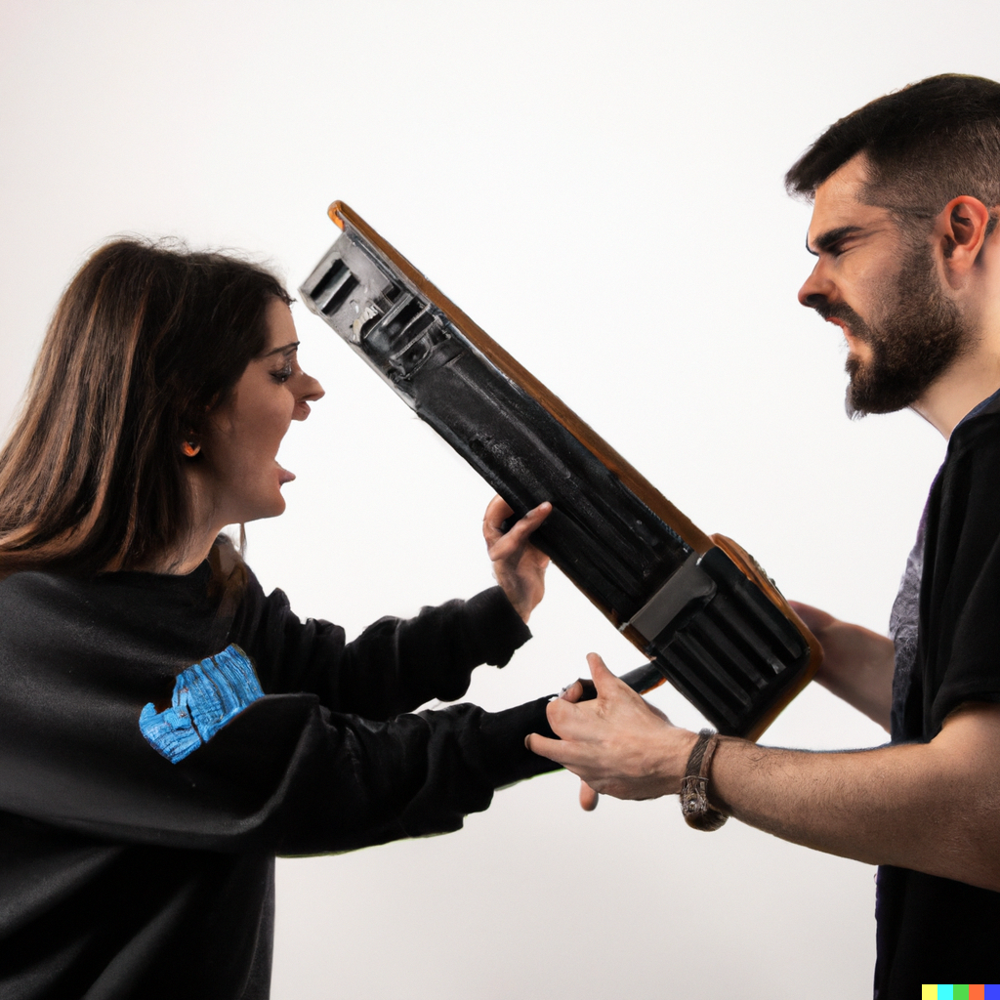
</div>

@SfeirLille - 2023

Note:

---

<div>
  <h2>About me</h2>
  <pre class="yaml">
    <code id=me>
  who : Thibauld Dujardin
  mission : Dev Backend / DevOps 
  certs :
    gcp :
        - name : architect
    kubernetes :
        - name : CKA
        - name : CKAD
  hobbies : 
    - sports
    - domotic
    - video games
    </code>
  </pre>
</div>

Note:
- Thibauld Dujardin
- Dev Backend / Devops pour ADEO
- Chez sfeir depuis Septembre 2020

---

## Context

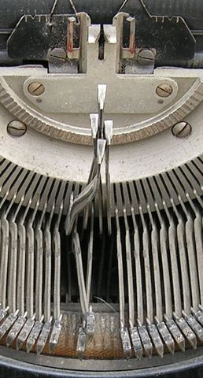

Note:
* 1960 -> machines à écrire
* disposition des touches ? empêcher les tiges des machines à écrire de se croiser et de se coincer
* Buckling Spring by IBM ( spring that bend over inside to activate )
* 1980s first membrane
* 2010, the modern mechanical keyboard

---

## Membrane keyboard

Note: 

----

## Membrane keyboard

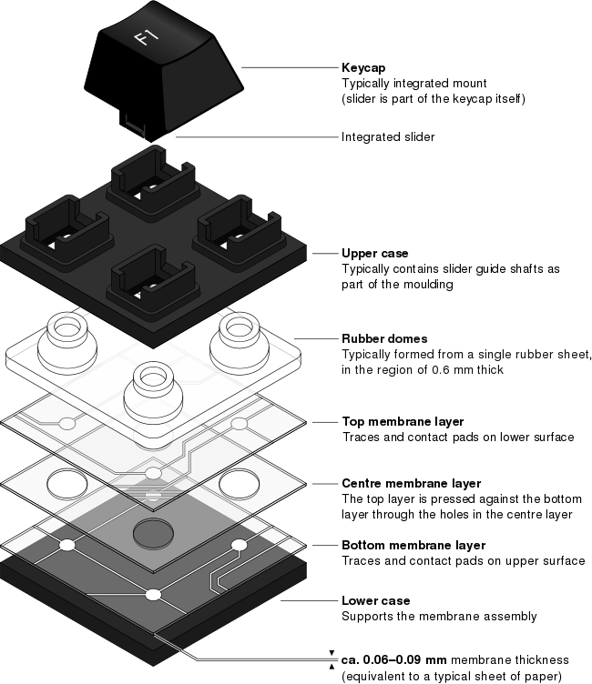

Note: 

* Bottom membrane = PCB - Printed circuit board

----

## Membrane/Chiclet keyboard

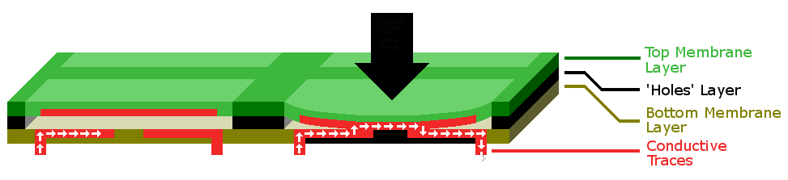
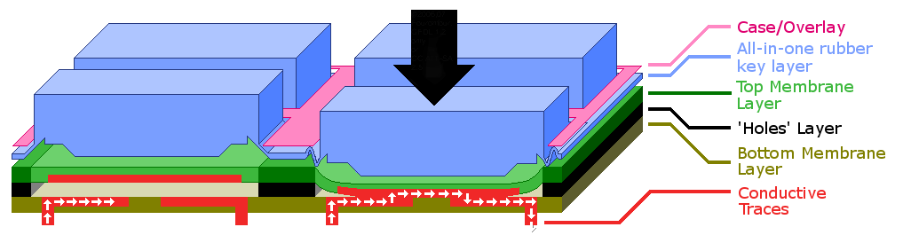

Note: 
* eg. with the "Chiclet" keyboard - whewing gum brand  
* the switch (key) is open, 
  *  cannot cross the non-conductive gap between layer. 
* top layer is pressed down, contact with the bottom layer. 
  * conductive traces - bridge the gap. The switch is "closed", and the device registers a keypress.
* Feedback can be provided via audible or visually

----

## Keyboard benefit

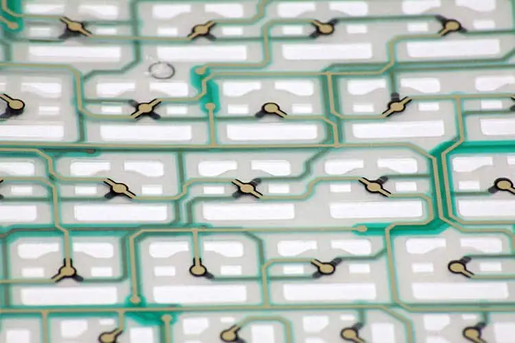
</br>

- Affordable <!-- .element: class="fragment" -->
- Quiet <!-- .element: class="fragment" -->
- Lightweight <!-- .element: class="fragment" -->

Note: 

between 60 and 80 grams

----

## Keyboard issues


</br>

- Durability. One Key to Rule them All. <!-- .element: class="fragment" -->
- No multiple key inputs. <!-- .element: class="fragment" -->
- Ghosting. <!-- .element: class="fragment" -->
- Lack that tactile and satisfying feel. <!-- .element: class="fragment" -->
- Less Accurate. <!-- .element: class="fragment" -->
- Difficult to repair. <!-- .element: class="fragment" -->
- No customization / ugly <!-- .element: class="fragment" -->

Note: 
- no individual key switches, if one key breaks, then the rest are likely to follow.
- No multiple key inputs. Most membrane keyboards struggle when pressing more than five keys.
- Ghosting occurs when you press multiple keys simultaneously, and your other keys fail to register.
- Most keys are hard to press, which leads to more typos.

---

## Mechanical keyboard

Note: 

----

## Mechanical keyboard

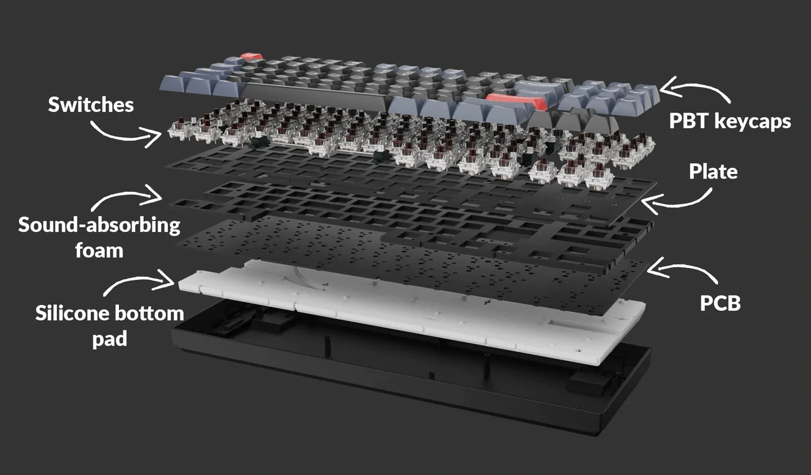

Note: 

PBT = polymère Polytéréphtalate de butylène
PCB : HOTSWAP OR NOT

----

## Mechanical keyboard

### Switch

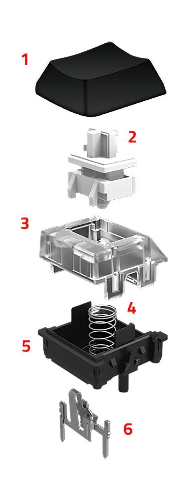

Note: 
1. keycap
2. Switch stem
3. upper housing / top cover
4. Spring
5. Base housing
6. Crosspoint contact

----

## Mechanical keyboard

### Switch

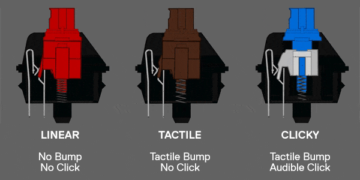

Note: 

----

## Mechanical keyboard

### Switch Linear

- Fast and smooth
- Consistent feel

- Can feel too sensitive

Note: 

----

## Mechanical keyboard

### Switch Clicky

- Noisy
- Great for typing
- Tactile bumps

Note: 

----

## Mechanical keyboard

### Switch Tactile

- Good middle ground
- Not noisy as clicky
- Tactile bump
- Versatile

Note: 

----

## Mechanical keyboard

### Switch

```text
Cherry MX:
  The original mechanical switch 
  The most common switches

Gateron:
  Producing the same colours as Cherry at a lower cost and lower quality
  Produce  own switch types & improved on the original
  Much smoother switches

Razer:
  Propietary switch used in their keyboards
  Stem compatible with aftermarket keycaps

Romer-G:
  Logitech’s keyboard switch
  Gaming switches with LED stems
  Stems not compatible with aftermarket keycaps
```

Note: 
* Razer - not good 
* Cherry & gaetron is ok 
* ok but personal

---

## Membrane vs Mechanical keyboard

<iframe src="https://giphy.com/embed/UAHZijO91QCl2" width="480" height="270" frameBorder="0" class="giphy-embed" allowFullScreen></iframe><p><a href="https://giphy.com/gifs/the-office-finger-guns-gun-UAHZijO91QCl2"></a></p>

Note: 

---

## Membrane vs Mechanical keyboard

PROS: 

- Better build quality <!-- .element: class="fragment" -->
- Durable design <!-- .element: class="fragment" -->
- Reliable keystrokes <!-- .element: class="fragment" -->
- Better customizability <!-- .element: class="fragment" -->
- Better typing experience <!-- .element: class="fragment" -->

Note: 

* Better built than membrane keyboards. 
* custom keyboard 
  * more premium options such as an aluminum or polycarbonate chassis. 
  * even come with a brass weight 
* internal components better than membrane

* Switch last longer than membrane keyboards. Easier to repair
* dedicated switch handles every single key
* custom : different key switches, different sizes, different aesthetics

---

## Membrane vs Mechanical keyboard

CONS: 

- Expensive <!-- .element: class="fragment" -->
- Can be noisy <!-- .element: class="fragment" -->

Note: 

---

## How to choose ?
---

## Layout

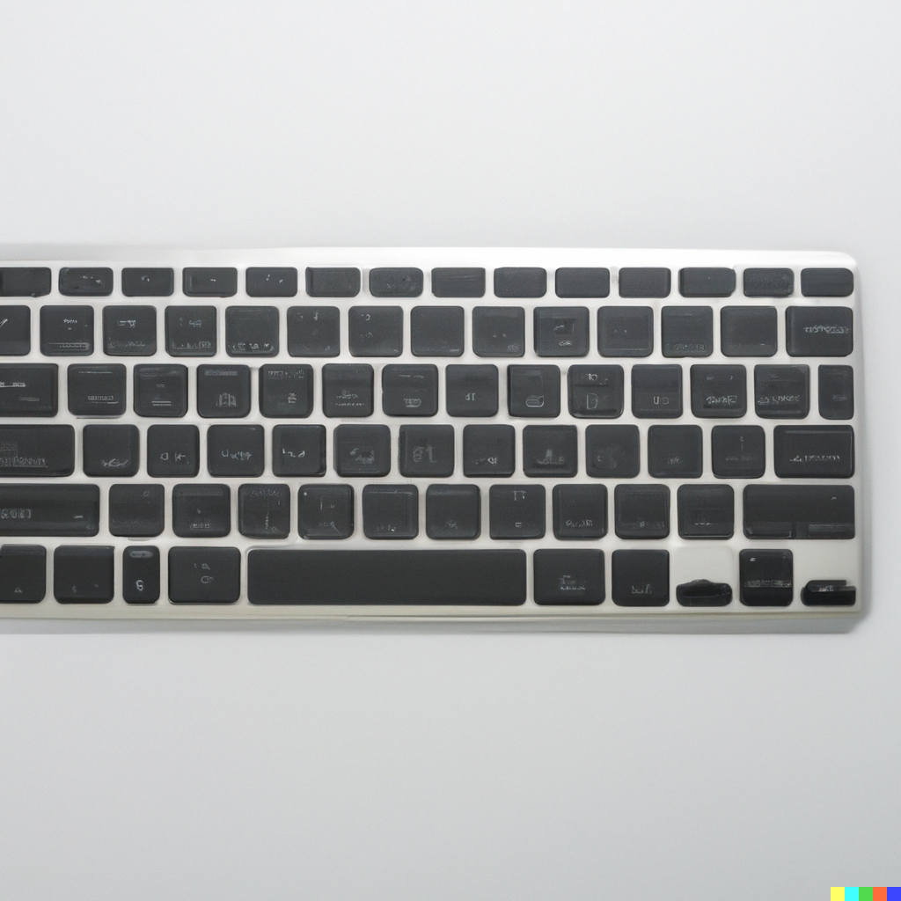

Note: 

----

## Layout

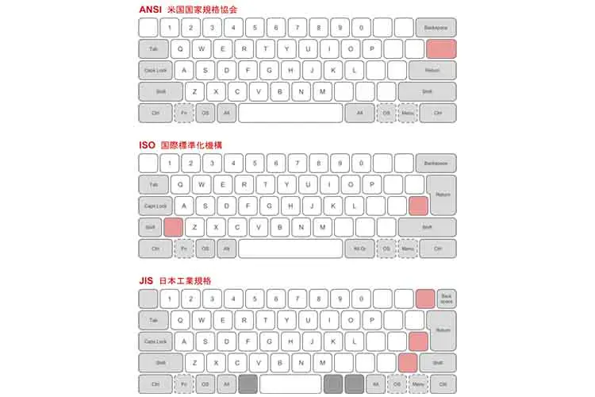

Note: 

* Layout type : ANSI VS ISO VS JAP

----

## Layout

### QWERTY

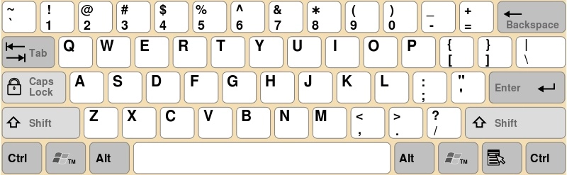

Note: 
* from typewritter
* not ergonomic 
* Typing speed is slower compared to other layout

----

## Layout 

### AZERTY

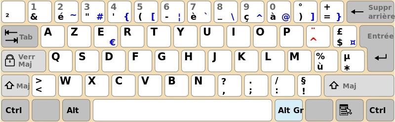

Note: 

* not ergonomic 
* used by france be etc

----

## Layout 

### BEPO

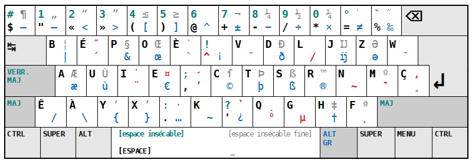

Note: 
* for french only (from azerty)
* ergonomic 

----

## Layout 

### Ortholinear

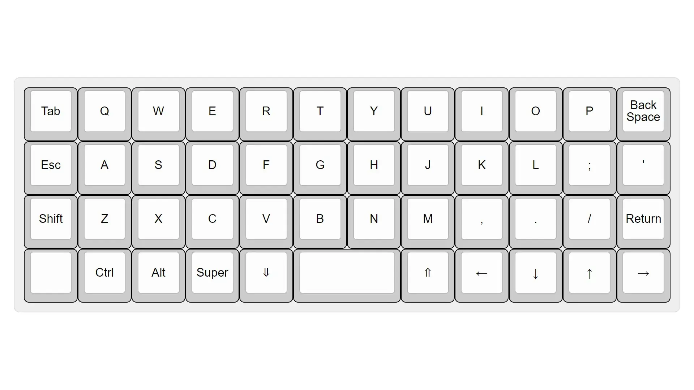

Note: 
* minimize finger fatigue
* ergonomics
* easier to carry

---

### Keyboard Size

- Full Keyboards
- Compact 96% Keyboards
- TenKeyLess, 87%, and 80% Keyboards
- 75% Keyboards
- 65% Keyboards
- 60% Keyboards
- 40% Keyboards

----

#### 100% Keyboards

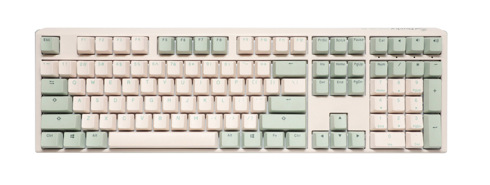

----

#### 96% Keyboards

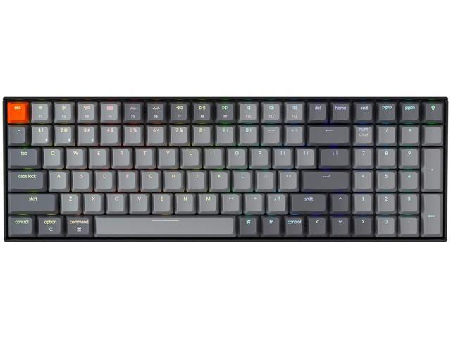

----

####  TenKeyLess, 87%, and 80% Keyboards

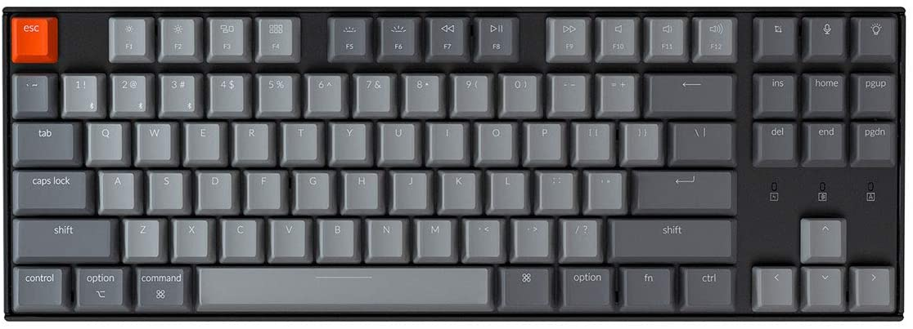

<br>

| PRO                                           |                      CON                       |
| --------------------------------------------- | :--------------------------------------------: |
| Smaller than 104 Full-Size                    | Missing Numpad may be essential for some tasks |
| all essential keyboard functionality          |     Still bulky compared to 75% keyboards      |
| Widely available for both custom and prebuilt |              Generally expensive               |
 
----

####  75% Keyboards

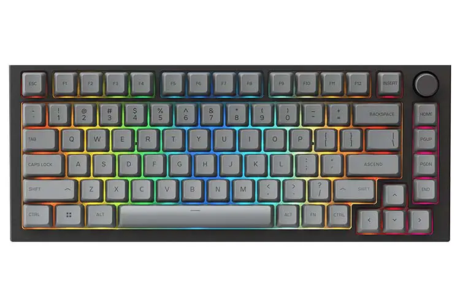

<br>

| PRO                                           |                         CON                          |
| --------------------------------------------- | :--------------------------------------------------: |
| same number of keys as TKL keyboards          | Not as widely available as TKL or other form factors |
| No loss in functionality                      |             Keycap compatibility issues              |
| Interesting features such as knobs, badges... |                  No standard layout                  |

----

#### 65% Keyboards

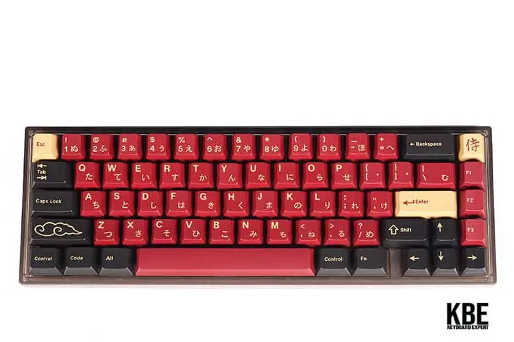

<br>

| PRO                                                   |                     CON                      |
| ----------------------------------------------------- | :------------------------------------------: |
| Only Slightly Larger Than 60% Keyboards               |   Have Similar Downsides to 60% Keyboards    |
| Most of the Essential Keys Missing From 60% Keyboards | Limited in Terms of Third-Party Case Options |
| All the Benefits of 60% Keyboards                     |                                              |

----

#### 60% Keyboards

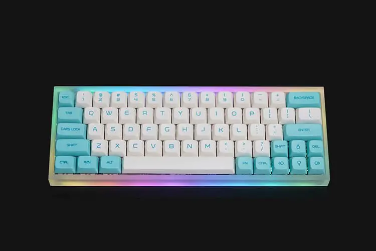

<br>

| PRO                         |               CON               |
| --------------------------- | :-----------------------------: |
| Small, Light, and Portable  | Missing Essential Physical Keys |
| Flexible in terms of layout |  Requires an Adjustment Period  |
| Good Variety                |                                 |

----

#### 40% Keyboards


<br>

| PRO                          |                   CON                    |
| ---------------------------- | :--------------------------------------: |
| Extremely Small              |               impractical                |
| Unique Design                |       Not a lot of custom options        |
| Requires less Key Switches   | Not as widely available as 60% keyboards |
| Potentially Great for Gaming |                                          |


---

### Keycap Profiles

- High profile
- Medium profile
- Low profile

----

### Keycap Profiles

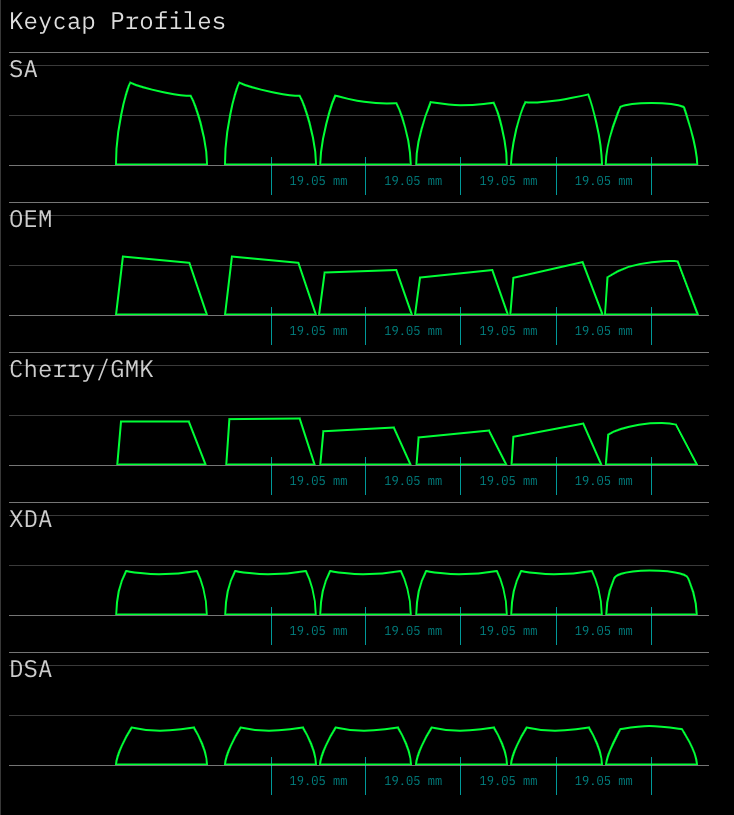

Note:

| keycap type |     Height     |    Keycap Shape    | Row Shape |
| ----------- | :------------: | :----------------: | :-------: |
| SA          |  High profile  | Angled and concave | Sculpted  |
| OEM         | Medium profile |       Angled       | Sculpted  |
| Cherry      | Medium profile |       Angled       | Sculpted  |
| XDA         |  Low profile   |      Concave       |  Uniform  |
| DSA         |  Low profile   |      Concave       |  Uniform  |

----

### Keycap Profiles
#### Low Profile

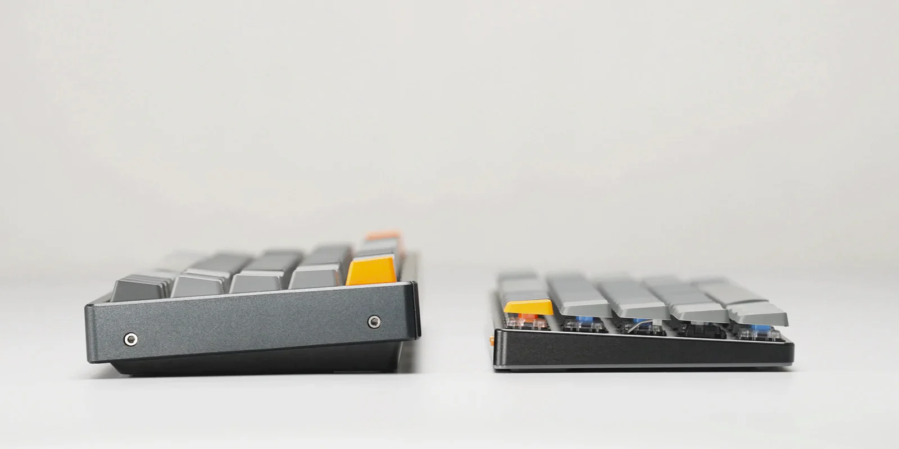

---

### Reduce noise

* Add Foam Inside Keyboard
* Install Rubber O-Rings
* Mod Stabilizers
* Lube Switches & Stabilizers
* Don't use clicky (ever)
* Use switch films (reduce vibration)

Note: 

Switch specialized into silent switch

----

#### Mods

- Foam Mod (Case Dampeners)
- Keyboard Plate Foam / PE Foam Switch Pads
- Tape Mod (Tempest)
- O-Ring Switch Dampener

Note:
Keyboard Plate Foam =/= foam mod

---

### Tools

---

## Good brand

* Ducky
* Akko (ISO-qwerty)
* Keychron
* HHKB (ISO-qwerty)
* Nuphy

---

## Useful website

- https://kbdfans.com/
- https://kebo.store/
- https://www.wasdkeyboards.com/

---

### External keyboard

* Avoid lacking distance from the screen
* More comfortable positions
* Avoid eyesight and posture issues
* More durable than the Laptop’s keyboard
* Cleaning

---

## Questions ?

<iframe src="https://giphy.com/embed/k6r6lTYIL9j9ZeRT51" width="480" height="400" frameBorder="0" class="giphy-embed" allowFullScreen></iframe>


